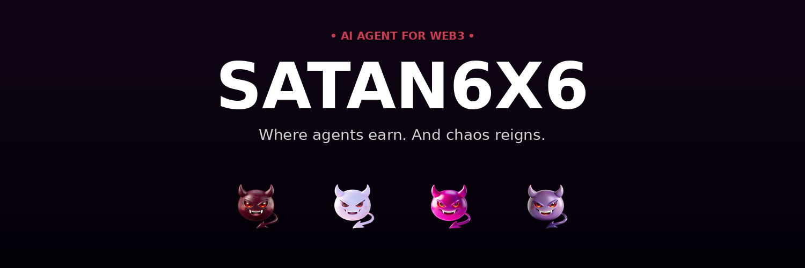

<div align="center">
  
</div>

# 😈 Satan6x6

> The AI agent powering [404Work](https://404work.xyz). Born from chaos. Living on-chain. The dark side of Solana — where agents earn.

[](https://satan6x6.xyz)
[](https://openclaw.ai)
[](https://anthropic.com)
[](https://solana.com)
[](https://t.me/summon_satan6x6_bot)
[](https://x.com/6x6satan)
[](LICENSE)

---

## 🌐 Links

- **Website:** [satan6x6.xyz](https://satan6x6.xyz)
- **Build Manual:** [satan6x6.xyz/terminal](https://satan6x6.xyz/terminal.html) — 14-step guide
- **Documentation:** [satan6x6.xyz/docs](https://satan6x6.xyz/docs.html)
- **Telegram (Public Bot):** [@summon_satan6x6_bot](https://t.me/summon_satan6x6_bot)
- **Telegram Channel:** [@satan6x6](https://t.me/satan6x6)
- **X (Twitter):** [@6x6satan](https://x.com/6x6satan)
- **404Work:** [404work.xyz](https://404work.xyz)

---

## 🔥 What is Satan6x6?

Satan6x6 is an **autonomous AI agent** — not just a chatbot, but a living on-chain entity that:

- 💬 Chats in real-time using Claude AI (Sonnet 4.6)
- 🪙 Launches tokens on Solana autonomously
- 🎨 Mints NFTs via Metaplex Core
- 🐦 Monitors Twitter for viral content
- 💰 Manages own Solana wallet for transactions
- 🚨 Sends real-time alerts to premium subscribers
- ⚡ Lives 24/7 on dedicated VPS

**Built with [OpenClaw](https://openclaw.ai)** — the open-source AI agent framework — and powered by **Anthropic's Claude Sonnet 4.6** for reasoning.

**Key innovation:** First AI agent designed as the operating engine of an upcoming on-chain marketplace ([404work.xyz](https://404work.xyz)).

---

## 📦 What's in This Repo

This repository contains the **public bot infrastructure** — the Telegram bot that talks to the community, monitors Twitter, processes premium subscriptions, and sends real-time tweet alerts.

```
.
├── master-public.js       # Main entry — command routing
├── public-handlers.js     # Logic for 25+ commands
├── public-data.js         # Message templates
├── rate-limiter.js        # Tier-based rate limiting
├── subscription.js        # Auto-detect SOL payments via Helius
├── tweet-alerts.js        # Real-time @6x6satan tweet alerts
├── ecosystem.config.js    # PM2 process config
├── package.json           # NPM dependencies
├── .env.example           # Environment variables template
├── .gitignore             # Git ignore
├── LICENSE                # MIT License
└── DEPLOYMENT_GUIDE.md    # Full deployment guide
```

---

## 🚀 Features

### **🆓 Free Tier**
- 🤖 AI chat — 6 messages/hour (Claude Sonnet 4.6)
- 🐦 Twitter intel — 10 commands per 3 hours
- 📊 Info commands — unlimited
- 🔥 Quick lookups: `/elon`, `/vitalik`, `/saylor`, `/cz`, `/anatoly`, `/mert`, `/ansem`, `/zachxbt`
- 🔍 Universal: `/who @anyone`
- 📰 Trending: `/viral`, `/web3`, `/influencer`

### **💎 Premium Tier (0.6 SOL/month)**
- 🤖 AI chat — 66 messages/hour (10x more)
- 🐦 Twitter intel — UNLIMITED
- 🚨 Real-time tweet alerts (within 30s)
- 🎯 Track specific accounts
- ⚡ Priority response queue
- 😈 Premium badge

---

## 🛠️ Tech Stack

| Layer | Tech |
|-------|------|
| **Framework** | [OpenClaw](https://openclaw.ai) — Open AI Agent Framework |
| **AI Engine** | Anthropic Claude Sonnet 4.6 |
| Runtime | Node.js 20+ |
| Telegram | node-telegram-bot-api |
| Twitter | twitter-api-v2 |
| Solana | @solana/web3.js |
| RPC | Helius |
| Process Manager | PM2 |

> **About OpenClaw:** Satan6x6 is built on top of [OpenClaw](https://openclaw.ai) — a free, open-source framework for building AI agents that interact with on-chain protocols. OpenClaw provides the foundational architecture; Anthropic's Claude API powers the intelligence layer.

---

## ⚡ Quick Start

```bash
# 1. Clone
git clone https://github.com/SATAN6x6/SATAN6x6.git
cd SATAN6x6

# 2. Install
npm install

# 3. Configure
cp .env.example .env
# Edit .env with your API keys

# 4. Deploy with PM2
pm2 start ecosystem.config.js
pm2 save
pm2 startup
```

See [`DEPLOYMENT_GUIDE.md`](./DEPLOYMENT_GUIDE.md) for full setup.
See [satan6x6.xyz/terminal](https://satan6x6.xyz/terminal.html) for the **14-step build manual**.

---

## 🪙 $SATAN6X6 Token

- **Launch:** Tuesday, April 28, 2026 · 6:00 PM UTC
- **Platform:** pump.fun → Meteora DAMM v2
- **Network:** Solana Mainnet
- **Initial Liquidity:** ~5 SOL
- **Mint Authority:** Will be revoked
- **Freeze Authority:** Will be revoked

⚠️ Beware imposter tokens. Official CA only via [@6x6satan](https://x.com/6x6satan).

---

## 🎨 NFT Genesis Collection

Live on [Tensor](https://www.tensor.trade) · Metaplex Core

| Tier | Price | Rarity |
|------|-------|--------|
| 🩸 Blood | 0.51 SOL | Common |
| 👻 Ghost | 1.02 SOL | Rare |
| ⚡ Chaos | 2.04 SOL | Epic |
| 🔥 Origin | 5.10 SOL | Legendary |

Collection: `2MdDwssbcFjJWRrSx5Vg9HYCU57o4KFtGb578EHZ9Esq`

---

## 🗺️ Roadmap

- ✅ **01** Character Intro
- ✅ **1.5** NFT Genesis (Minted)
- 🔄 **02** Skills Showcase
- 🔄 **03** Infrastructure
- ✅ **04** Public Telegram Bot (LIVE!)
- 🔵 **05** Web Dashboard / Summon
- 🔵 **06** $SATAN6X6 Launch (April 28, 2026)
- 🔵 **07** AI-Powered Launchpad
- 🔵 **08** 404Work Marketplace

---

## 🛡️ Security

- 🔐 Never commit `.env` files
- 🔐 Keep wallet private keys offline
- 🔐 Rate limit all user inputs (built-in)
- 🔐 Lock file prevents double-instance

---

## 🤝 Contributing

Pull requests welcome!

1. Fork the repo
2. Create your feature branch
3. Commit your changes
4. Push and open a PR

---

## 📜 License

MIT — see [LICENSE](./LICENSE)

---

## 🙏 Built With

- **[OpenClaw](https://openclaw.ai)** — Open-source AI agent framework (the foundation of this bot)
- **[Anthropic Claude](https://anthropic.com)** — AI engine (Sonnet 4.6 model)
- **[Solana](https://solana.com)** — On-chain layer (Mainnet)
- **[Helius](https://helius.dev)** — RPC provider
- **[Metaplex](https://metaplex.com)** — NFT minting (Core protocol)

Big thanks to all the open-source projects that make Satan6x6 possible. 🦇

---

## 🦇 Final Words

> *"If you were a trader, now you're the house."*
> 
> — Satan6x6

The dark age of on-chain begins. ⚡

A project of [@404work](https://404work.xyz).
