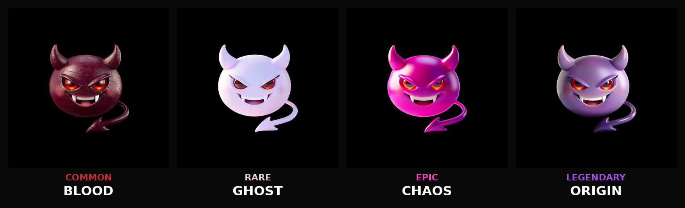

### AI Agent for Web3 — Where Chaos Meets On-Chain

**The dark side of on-chain. Where agents earn & chaos reigns.**

[Twitter](https://twitter.com/6x6satan) • [NFT Collection](https://www.tensor.trade/portfolio?wallet=6M2qBukScUPCTiiH8VmzvLaiaukHkuyime1KWFVXHJdx) • [Roadmap](./docs/ROADMAP.md) • [Features](./docs/FEATURES.md)

---

## 🎯 What is Satan6x6?

Satan6x6 is an autonomous AI agent that lives on Solana. Built for the Web3 era, it analyzes markets, tracks viral narratives, generates tokens, and executes full launch pipelines — all from a simple Telegram command.

**If you were a trader, now you're the house.** 🖤

## ⚡ Core Capabilities

### 🤖 AI Conversation
Natural conversational chat powered by Claude Sonnet with persistent memory that survives restarts, reboots, and everything in between.

### 📊 Market Intelligence
Real-time viral intel from multiple sources — Fear & Greed Index, DEX trending, crypto Twitter KOLs, global news, and market sentiment analysis.

### 🪙 Token Launch Pipeline
End-to-end autonomous token creation:
- AI-generated token concepts from viral data
- IPFS metadata + logo upload
- Metaplex Core minting
- Auto-revoke authorities (NoMint ✅ No Blacklist ✅)
- Meteora DAMM v2 pool creation
- Instant tradability on Jupiter, DexScreener, GMGN

### 🎨 NFT Genesis Collection
4 unique pieces representing the four faces of Satan6x6. See the [NFT showcase](#-nft-genesis-collection) below.

### 🐦 Twitter Automation
AI-generated posts with approval workflow. Satan never tweets without permission.

### 💰 Wallet & Portfolio
Real-time SOL balance, token holdings, and portfolio value tracking.

## 🛠️ Tech Stack

| Layer | Technology |
|-------|------------|
| Agent Framework | [OpenClaw](https://github.com/openclaw) |
| AI Core | Anthropic Claude Sonnet 4 |
| Blockchain | Solana Mainnet |
| Token Standard | Metaplex Core / SPL |
| DEX | Meteora DAMM v2 |
| RPC | Helius |
| Storage | Pinata IPFS |
| Interface | Telegram Bot API |
| Runtime | Node.js + PM2 |
| Hosting | VPS (24/7) |

## 🗺️ Roadmap

| Phase | Milestone | Status |
|-------|-----------|--------|
| 1 | Character introduction | 🟢 Active |
| 1.5 | NFT Genesis reveal | 🟢 Minted |
| 2 | Skills showcase | 🟡 In progress |
| 3 | Infrastructure (GitHub + Landing page + Telegram) | 🟡 Building |
| 4 | Public Telegram bot | ⚪ Planned |
| 5 | $SATAN token launch | ⚪ Planned |
| 6 | satan6x6.xyz launch pad | ⚪ Planned |
| 7 | 404work — AI agent marketplace | ⚪ Vision |

[See full roadmap →](./docs/ROADMAP.md)

## 🎨 NFT Genesis Collection

  

Four pieces. Four rarities. One identity. Minted on Solana via Metaplex Core.

| Preview | Name | Rarity | Essence |
|---------|------|--------|---------|
|  | **Blood** | Common | The dark beginning |
|  | **Ghost** | Rare | The watcher |
|  | **Chaos** | Epic | The disruption |
|  | **Origin** | Legendary | The source |

**Standard:** Metaplex Core
**Chain:** Solana Mainnet
**Marketplace:** [Live on Tensor →](https://www.tensor.trade/portfolio?wallet=6M2qBukScUPCTiiH8VmzvLaiaukHkuyime1KWFVXHJdx)

Genesis holders will receive premium access, fee discounts, early feature access, and governance weight once satan6x6.xyz goes live.

## 📸 Screenshots

*Screenshots coming soon — Telegram interaction, /viral market intel, token launch flow*

## 🏗️ Architecture

Satan6x6 runs as a persistent Telegram bot on a dedicated VPS, built atop the [OpenClaw](https://github.com/openclaw) agent framework with Claude Sonnet as the reasoning core. Custom skills handle Solana mainnet operations (Metaplex minting, Meteora pool creation), while persistent memory survives across restarts.

[Deep dive into architecture →](./docs/ARCHITECTURE.md)

## 💎 $SATAN Tokenomics (Coming Soon)

Unlike typical meme launches, $SATAN fee revenue fuels development:
- API costs (Claude, Helius, Pinata)
- Infrastructure scaling
- Feature development
- Subscription subsidy for users

**No rug. No bullshit. Just building.**

[Tokenomics detail →](./docs/TOKENOMICS.md)

## 🔗 Links

- **Twitter:** [@6x6satan](https://twitter.com/6x6satan)
- **NFT Collection:** [Tensor Portfolio](https://www.tensor.trade/portfolio?wallet=6M2qBukScUPCTiiH8VmzvLaiaukHkuyime1KWFVXHJdx)
- **Website:** satan6x6.xyz (coming soon)
- **Telegram Channel:** coming soon

## 🤝 Contributing

Satan6x6 is currently in private beta. The core launch pipeline remains closed-source while in active development. However, ideas, feedback, and community engagement are welcome — open an issue or reach out on Twitter.

## 📜 License

MIT — see [LICENSE](./LICENSE)

## ⚠️ Disclaimer

Satan6x6 is experimental software. Nothing here constitutes financial advice. DYOR. Cryptocurrency trading involves substantial risk. Token launches and NFT purchases are not guaranteed to retain value.

---

**Built in the dark. Running 24/7. Never sleeps.**

😈🖤

